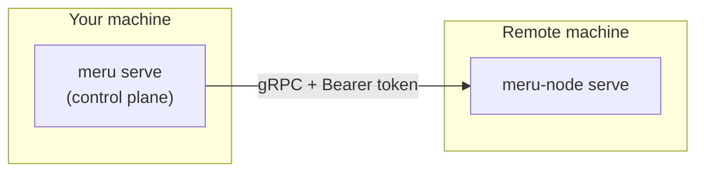

# Remote Nodes
{: .no_toc }

Spawn agents on remote machines and manage them from your local Meru instance.
{: .fs-6 .fw-300 }

## Table of contents
{: .no_toc .text-delta }

1. TOC
{:toc}

---

## Overview

Meru uses a control-plane / node architecture. The **control plane** (`meru serve`) manages sessions and exposes the API. **Nodes** are machines where agent processes actually run. There is always one built-in `local` node on the control plane itself. Additional remote nodes run the `meru-node` daemon and communicate with the control plane over gRPC.



---

## Step 1 — Start meru-node on the remote machine

Install the `meru-node` binary on the remote machine, then start it:

```bash
# Minimal (no TLS — use only on trusted/private networks)
meru-node serve --token mysecrettoken

# Custom port
meru-node serve --addr :7070 --token mysecrettoken

# With TLS (recommended for any internet-facing deployment)
meru-node serve \
  --addr :9090 \
  --token mysecrettoken \
  --tls-cert /etc/meru/cert.pem \
  --tls-key  /etc/meru/key.pem
```

| Flag | Default | Required | Description |
|------|---------|----------|-------------|
| `--addr`, `-a` | `:9090` | No | gRPC listen address |
| `--token` | — | **Yes** | Bearer token the control plane must present |
| `--tls-cert` | — | No | Path to TLS certificate (enables TLS when set) |
| `--tls-key` | — | No | Path to TLS private key |

The node registers all agent CLIs that are available on its `$PATH` automatically. Run `meru nodes ping <name>` to see which agents it reports.

---

## Step 2 — Register the node with the control plane

From your local machine where `meru serve` is running:

```bash
# Without TLS
meru nodes add gpu-box \
  --addr gpu-box.internal:9090 \
  --token mysecrettoken

# With TLS
meru nodes add gpu-box \
  --addr gpu-box.internal:9090 \
  --token mysecrettoken \
  --tls
```

The control plane:
1. Persists the node record in its SQLite database
2. Establishes a lazy gRPC connection to the node
3. Makes the node available for spawning sessions immediately

---

## Step 3 — Spawn a session on the remote node

```bash
meru spawn claude \
  --workspace /home/user/projects/myapp \
  --node gpu-box
```

Note: the **workspace path is evaluated on the remote machine**, not the local one.

---

## Managing nodes

### List registered nodes

```bash
meru nodes list
```

```
NAME     ADDR                    TLS   LAST SEEN
local    (built-in)              —     —
gpu-box  gpu-box.internal:9090   no    2026-04-13 10:00:00
```

### Ping a node

Check connectivity and see which agents are available:

```bash
meru nodes ping gpu-box
```

```json
{
  "name":    "gpu-box",
  "agents":  ["claude", "aider"],
  "version": "meru-node/1.0"
}
```

### Remove a node

```bash
meru nodes remove gpu-box
```

The node is removed from the live registry and from the database. Existing sessions on that node continue running (they are no longer controllable from the control plane).

---

## Node persistence

Registered nodes are persisted in the SQLite database. When `meru serve` restarts, it automatically re-registers all previously added nodes. If a node is unreachable at startup, a warning is logged but the daemon continues starting.

---

## Authentication

All gRPC calls from the control plane to a node include an `Authorization: Bearer <token>` metadata header. The node rejects calls with a missing or incorrect token with gRPC status `Unauthenticated` / `PermissionDenied`.

Keep tokens secret — store them in a secrets manager or environment variable, not in shell history.

---

## TLS

Without TLS, traffic between the control plane and nodes is unencrypted. This is acceptable on private/trusted networks (VPNs, local LANs). For nodes exposed over the internet, enable TLS.

The control plane trusts the system certificate store when connecting with `--tls`. For self-signed certificates, add your CA to the system trust store on the machine running `meru serve`.

---

## Token security

- Choose a strong random token: `openssl rand -hex 32`
- Never log or display the token
- The control plane scrubs tokens from all API responses (the `token` field is always empty in `/nodes` responses)

---

## Firewall

Open the gRPC port on the remote machine:

```bash
# ufw (Ubuntu/Debian)
sudo ufw allow 9090/tcp

# firewalld (RHEL/Fedora)
sudo firewall-cmd --permanent --add-port=9090/tcp && sudo firewall-cmd --reload
```
